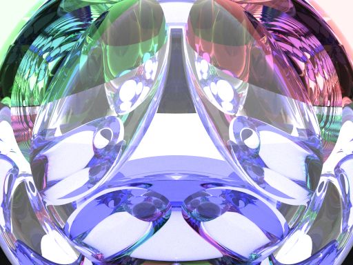

# path-tracer
C++: Path Tracing Application

This project was undertaken on the weekend of 4th July 2020, with the aim of improving my knowledge and ability in C++ whilst also learning more about an aspect of programming I haven't had experience with yet: Graphics.

This application is inspired by the book Realistic Ray Tracing by Peter Shirley, and implementation inspired by smallPT.

Features:
- Monte Carlo Path Tracing
- Russian Roulette for unbiased path termination and determining whether to reflect or refract for Refractive material
- OpenMP for multi threading
- Subsampling of 2x2 subpixels for anti-aliasing
- Explicit lighting

Output is determined by the defined scene (spheres) and number of samples (more samples = higher quality). Here are some examples:

Cornell Box scene at 200 SPP - took about 2 minutes.

Cornell Box scene at 40 SPP - took about 20 seconds.

Scene with lots of spheres.
